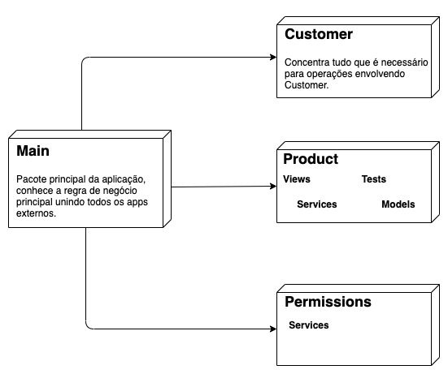

# template_django_with_docker

Esse repositório é um modelo de um projeto de desenvolvimento de uma aplicação backend usando Django com Docker e fazendo uso de banco de dados Postgresql (para persistência dos dados em geral) e Redis (como cache).

## Objetivo

O objetivo desse repositório é ter algo como um "bootstrap" para facilitar na criação rápida de projetos backend usando essas tecnologias, permitindo focar mais nas regras de negócio do que em configurações em geral. É uma ótima opção para iniciar projetos rapidamente, ou ajudar a inicializar um projeto para um processo seletivo, por exemplo.

## Tecnologias

Esse repositório em específico faz uso de tecnologias muito úteis e que comumentemente são usados por empresas no seu dia-a-dia, mesmo em ambientes de produção, como:

- **Python**
- **Django**
- **Postgres**
- **Redis**
- **Docker**
- **Docker-compose**
- **Pipenv**

## Passo-a-passo para inicializar o projeto

### 1. Inicializando ambiente com Pipenv

O projeto faz uso do pipenv para gerenciar um ambiente virtual específico para a nossa aplicação e deixando isolado dos demais ambientes e mesmo da instalação da máquina local quanto às libs do Python. Dessa forma, o pipenv foi a ferramenta escolhida para manter e gerenciar esse ambiente virtual. Certifique-se de ter o pipenv instalado na sua máquina, o processo é bem simples, portanto iremos pular essa parte aqui no passo-a-passo.

Com o pipenv instalado, vamos criar o nosso ambiente virtual:

```batch
pipenv --python 3.7
```

Ao criar o ambiente, será gerado um arquivo Pipfile que, por ora, só diz que o projeto utiliza o Python na versão 3.7. Esse arquivo será responsável por gerenciar todas as dependências do nosso ambiente virtual. Se você vem do mundo Java, esse arquivo funciona como um pom.xml do maven.

Agora que temos um ambiente virtual par ao nosso projeto, vamos instalar o Django nesse ambiente.

### 2. Instalando Django

Usando o pipenv, utilizaremos o comando abaixo para instalar o Django:

```batch
pipenv install django==3.0
```

Legal, agora nosso ambiente possui o Python e Django, você pode checar isso no Pipfile.

Percebeu que surgiu um novo arquivo aí chamado Pipfile.lock? Esse arquivo é muito importante porque ele é gerado especificando exatamente quais as versões de bibliotecas externas que foram instaladas em sua máquina.

E porque isso é importante? É importante porque caso você precise mudar de máquina enquanto está desenvolvendo sua aplicação, esse arquivo ajudará a replicar o ambiente virtual idêntico em uma nova instalação e com isso você sempre tem a tranquilidade de saber que está usando as mesmas versões e que a compatibilidade entre elas permanece.

### 3. Ativando o ambiente virtual

O ambiente virtual agora existe e já tem a carinha do projeto, mas para o usarmos de fato, precisamos ativá-lo:

```batch
pipenv shell
```

Nosso ambiente agora está ativo, podemos checar usando os comandos:

```batch
pipenv --venv
```

Ou

```batch
pipenv --where
```

Ambos devem apontar ou referenciar o nome do diretório em que criamos o projeto.

### 4. Iniciando um projeto django

O comando abaixo irá criar um diretório config de uma aplicação Django. O "." passado no final do comando é para dizer ao django criar o projeto a partir do diretório raiz. Por padrão, ele criaria um diretório extra e dentro desse diretório criaria o config, mas aqui vai do gosto do freguês e de como se quer organizar o projeto.

```batch
(template_django_with_docker) ➜ :~$ django-admin startproject config .
```

Com o comando executado, nosso projeto ficará com a seguinte estrutura:

```batch
(template_django_with_docker) ➜ :~$ tree
.
├── LICENSE
├── Pipfile
├── Pipfile.lock
├── README.md
├── config
│   ├── __init__.py
│   ├── asgi.py
│   ├── settings.py
│   ├── urls.py
│   └── wsgi.py
└── manage.py
```

### 5. Pensando na arquitetura do Projeto

Antes de adicionarmos os módulos do Django, seria interessante pensar na forma de organização que teremos no nosso projeto. 

Para esse projeto, nesse repositório iremos implementar uma arquitetura que considero mais simples, que têm seus prós e contras, como tudo na vida, mas que sua simplicidade permite identificar alguns pontos de melhoria e repensar para novos desenhos. Futuramente quero adicionar novos repositórios ilustrando outros desenhos e deixar a escolha a cargo do desenvolvedor de qual se adequa melhor à sua solução.





**Sobre o arquitetura**:

No desenho acima, está uma exibição de como seriam as dependências dos módulos da aplicação:

- **main** é o pacote principal, ele depende de conhecer todos os outros pacotes da aplicação para executar as principais regras de negócios do domínio da aplicação. Ou seja, ele depende dos demais módulos e ninguém deve depender dele. Nesse desenho é fácil pensar no sentido das dependências e fácil perceber quando algo está desobedencendo o desenho proposto para o domínio. Sempre que elementos de apps externos sejam necessários trabalhar de forma conjunta, é no pacote main que ele deve existir, por exemplo, o diagrama mostra os pacotes externos Product e Customer, caso fôssemos implementar uma lista de produtos para um cliente, provavelmente esse código deveria estar no main, é fácil perceber que o módulo Product não deveria conhecer o Customer e o inverso também. Criar um novo pacote para manipular essa lista de produtos para os clientes poderia ser uma opção, mas seria um pacote bastante restrito, o que torna sua reutilização mais difícil.

- **Product** e **Customer** são pacotes externos que lidam de forma isoladas com um domínio bem específico, por exemplo, o pacote Customer não depende de mais ninguém para executar suas regras de domínio e deve conhecer um conjunto de regras muito específico que dizem respeito somente a como a aplicação irá gerenciar um Customer. Nesse pacote, podem existir coisas como o Modelo de Customer, que no Django, é a estrutura que irá representar um Cliente no banco de dados da aplicação, serviços que saber manipular um Cliente, os endpoints para dar acesso às operações em Cliente, testes unitários específicos para essas operações. Essa separação evidência de forma clara que a responsabilidade desse pacote é bem específica, conhecer e manipular cliente, e isso é bom, é fácil identificar que se tenho algum problema na minha aplicação envolvendo cliente, que provavelmente, esse é o pacote que vou ter que dar manutenção e que como ele não depende de ninguém externamente, isso facilita sua manutenibilidade. Por outro lado, essa abordagem faz com que as regras de negócio se espalhem por toda a aplicação, não ficando somente no módulo main. Mas como isso ocorre? Se ao definir a estrutura Customer, for especificado que o Customer possui um nome e um email, e que esse email é único para um mesmo cliente, essa regra estaria representada no módulo Customer, mas essa é uma regra do domínio da aplicação, logo deveria estar no módulo main que seria o ponto principal a conhecer as regras da aplicação.

## Prós e contras desse desenho arquitetural

### Prós
- Simplicidade, fácil identificação das dependências do projeto
- Regra de negócio principal do projeto fica contida somente num lugar, módulo main.
- Os pacotes externos têm responsabilidades bem definidas e, quando preciso, somente um motivo para serem alterados

### Contras
- Módulo main possui alto acoplamento, qualquer alteração nos demais módulos, podem causar necessidade de alteração no main.
- O main pode crescer de forma bastante considerável, pode ser um fator importante dependendo do tamanho do projeto
- As regras de negócio podem ser espalhadas, existindo tanto no main quanto nos demais módulos, mesmo que de forma mais específica.


